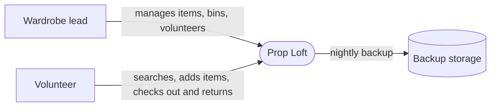
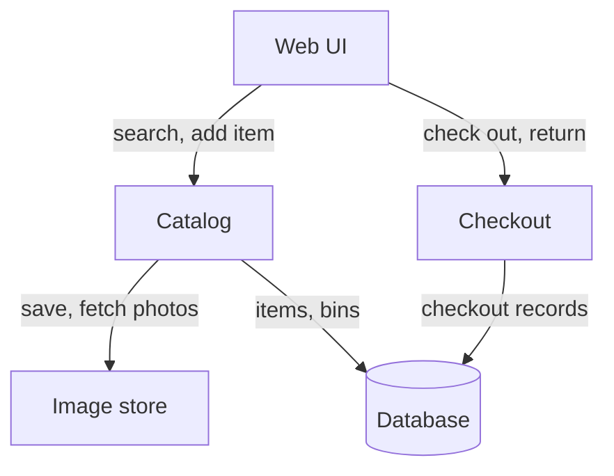

# Prop Loft — Design Document

> **A teaching project.** Prop Loft is the worked example for BYU's CS 301R, *Founding an Open-Source Project*. The theater, the interviews, the item counts, and the spike results cited below are **invented for teaching**. They show what real evidence looks like in a design document; they are not claims about a real theater. This document is the *revised* version of a deliberately imperfect draft: the revision history records what design review changed, and why.

| | |
|---|---|
| **Authors** | A. Reyes, J. Okafor |
| **Reviewers** | M. Tanaka (design-review partner) |
| **Status** | Approved |
| **Last updated** | Week 7 |
| **Links** | [README](../README.md) · [issue tracker](https://github.com/prop-loft/prop-loft/issues) |

## Revision history

| Date | Author | What changed |
|---|---|---|
| Week 6, Mon | A. Reyes | Skeleton from the in-class session |
| Week 6, Wed | J. Okafor | Diagrams from the workshop; data model; tech choices |
| Week 7 | A. Reyes, J. Okafor | Revised after design review: specified the Checkout component; named the network assumption and traced the failure case; argued the single-tenant decision; cut the column dump, the code listing, and the pinned versions; removed the email notifier the MVP never included; reordered the plan into vertical slices. Renamed the project from Backstage to Prop Loft, because that name belongs to Spotify's developer portal. |

---

## 1. Context and scope

Prop Loft (formerly Backstage) is a phone-first web catalog for a community theater's stock. Wardrobe volunteers search what the theater owns from the shop floor, see a photo and bin location, and check items out to actors against a show. The argument for the project, the interviews, and the upload spike are in the proposal.

This document covers the MVP: one theater's **costume** stock, seeded with 60 items and tested during a production strike. The name and the data model are deliberately broader: props and set pieces are the roadmap, not the MVP.

## 2. Goals and non-goals

**Goals**

- A volunteer answers "do we own this?" from a phone in under a minute.
- Every checked-out item shows who has it, for which show, and when it's due back.
- A non-technical volunteer can add an item with no verbal instruction.
- The theater can keep running the system after the semester, with no developer on call.

**Non-goals**

- No ticketing, box office, or budgeting.
- No rental marketplace between theaters.
- No native mobile app — a responsive web app only.
- No barcode or RFID hardware; bins carry typed short IDs.
- No public-facing catalog.
- No email or text notifications. Overdue items show up in the app; reminding the actor stays a person's job.

## 3. System-context diagram

Actors never touch the system directly: the volunteer checks items out *to* them. That is why they don't appear here, and why there is no notifier.

## 4. Architecture and components

| Component | Responsibility | Talks to | Interface (rough) |
|---|---|---|---|
| **Web UI** | Server-rendered pages for search, item detail, add item, check-out, and return. Downscales photos in the browser before upload. Keeps form input on a failed save. | Catalog, Checkout | HTML forms; HTMX partial updates |
| **Catalog** | Owns items, categories, bins, and photos. Search by name, category, and size. | Database, Image store | Django views and models |
| **Checkout** | Owns checkout records. Enforces **at most one open checkout per item**. Records returns. An item is **overdue** when its due date has passed with no return. | Database | Check-out and return form posts; an overdue list for the wardrobe lead |
| **Image store** | Saves and serves photos. | Local disk | A storage interface, so object storage can replace the disk later |
| **Auth** | Two roles: wardrobe lead and volunteer. | Database | Django's built-in authentication |

### Core flow, traced end to end: a volunteer checks out a costume

1. The volunteer searches "bustle" in the Web UI.
2. Catalog queries the database and returns matching items with photos and bin locations.
3. The volunteer opens an item and taps **Check out**, choosing the actor and show from lists and a due date.
4. Checkout writes a checkout record. The database refuses a second open checkout for the same item.
5. The Web UI shows the item as out, with the actor's name and due date — **only after the server confirms the save**.

### The failure case: the network drops mid-checkout

**The assumption this design depends on, stated:** the shop floor's wifi is unreliable. Our own upload spike showed failures on it, and strike night is when checkouts peak.

So the flow must survive step 4 failing or timing out:

- The form keeps everything the volunteer entered and shows **"Not saved — try again"**. Nothing is re-typed.
- The item is never shown as "out" on the strength of a request the server didn't confirm. A volunteer who sees "out" can trust it.
- Retrying is safe. If the first attempt actually reached the server, the one-open-checkout rule means the retry can't create a duplicate: Checkout recognizes the same item, actor, and show, and reports success.

## 5. Data model

| Entity | Key fields | Relationships | MVP or roadmap |
|---|---|---|---|
| Item | name, category, size, condition, bin, photo | belongs to one Bin; has many Checkouts | MVP (costumes); props and set pieces are roadmap |
| Bin | short ID, description | has many Items | MVP |
| Show | title, opening date | has many Checkouts | MVP |
| Person | name, phone | has many Checkouts | MVP |
| Checkout | out date, due date, returned date | belongs to one Item, one Person, one Show; at most one open per Item | MVP |
| PullList | show, items | belongs to one Show | Roadmap |

Two rules the schema must enforce, not just the code: an item can't be deleted while it's checked out, and a bin can't be deleted while it holds items.

## 6. Technology choices and alternatives considered

### Decision: one deployment per theater

- **Chosen:** single-tenant — each theater runs its own copy on its own small server.
- **Alternative considered:** one shared, multi-tenant service hosting many theaters.
- **Why the chosen option wins, given our goals:** the goal that matters most here is that a theater keeps running the system with no developer on call. A shared service needs someone to operate it for everyone, forever; a single-tenant copy needs only the theater's own volunteer. It also makes data isolation trivial: no theater can see another's stock by accident.
- **Evidence:** the wardrobe lead's interview — the theater has no IT staff and a volunteer who "can follow instructions." No measured data; this is a judgment about who will maintain the system.
- **What would change our mind:** if several theaters want to share or lend stock (the roadmap's inter-theater sharing), a shared service becomes worth its operating cost. That's a later decision, and it's the one most likely to be revisited.

### Decision: PostgreSQL for the database

- **Chosen:** PostgreSQL
- **Alternative considered:** SQLite, which would remove a service from the server entirely
- **Why the chosen option wins, given our goals:** checkouts on strike night happen concurrently — the observation had three volunteers returning items at once — and SQLite serializes writes. Postgres also matches the Django tooling both authors already know.
- **Evidence:** the strike-night observation; neither author has run SQLite under concurrent writes, so this is a reasoned choice rather than a measured one.
- **What would change our mind:** if the server's memory can't hold Postgres alongside the app, SQLite with write retries is the fallback.

Local development uses SQLite so the app runs without a database server; the concurrency argument applies to the deployed system.

### Decision: downscale photos in the browser before upload

- **Chosen:** client-side downscaling to 1600 px
- **Alternative considered:** upload full resolution and resize on the server
- **Why the chosen option wins, given our goals:** the shop's wifi is the bottleneck, not the server. Resizing on the server still sends the full image over the weak connection.
- **Evidence:** the upload spike — full-resolution uploads had a 71 s median with 3 of 10 failures on a throttled connection; downscaled uploads had a 48 s median with none.
- **What would change our mind:** nothing short of the theater getting better wifi.

### Other choices

Django (the current long-term-support release), HTMX for partial page updates, Pillow for image handling, gunicorn, on a small Ubuntu LTS server. Exact versions live in [`requirements.txt`](../requirements.txt), not here, so this document doesn't go stale with every upgrade.

## 7. Risks and open questions

| Risk or question | Why it matters | Owner | How we'll find out, and by when |
|---|---|---|---|
| HEIC photos from iPhones don't render | Half the volunteers use iPhones; the core feature silently breaks | J. Okafor | Test on a borrowed iPhone — milestone 3 |
| HTMX is new to both of us | Could cost days | A. Reyes | Four-hour learning box; fall back to plain forms |
| Volunteers keep using the paper notebook | The catalog goes stale | A. Reyes | Co-design the add-item form with the wardrobe lead before building it |

## 8. Implementation plan

Each milestone is a **vertical slice**: something a volunteer could use end to end, however plain, before the next one starts.

| Milestone | What works when it's done | Depends on |
|---|---|---|
| 1 | The core flow, thinnest possible: find an item by name, open it, check it out, see it marked out. Items entered through the admin; no photos, no styling. | — |
| 2 | Returns, and the wardrobe lead's overdue list. | 1 |
| 3 | A volunteer adds an item, with a photo downscaled in the browser. The HEIC test. | 1 |
| 4 | Roles: what a volunteer can do versus the wardrobe lead. Phone-friendly layout. | 2, 3 |
| 5 | Deploy to the theater's server; seed 60 items; the strike-night trial. | 4 |

**Where the repository stands:** milestone 1 is in progress. The item list works; search is next.

---

## Sign-off

| Reviewer | Role | Date | Approved |
|---|---|---|---|
| M. Tanaka | Design-review partner | Week 7 | ☑ |
